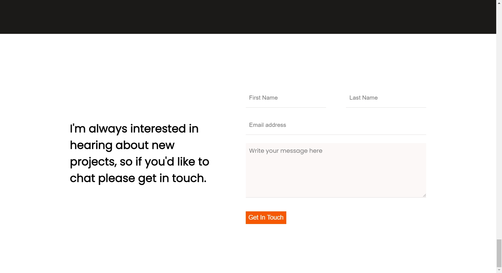

# Contact Form!

> A Portfolio project built with html/css with support for linters and web accessibility.

## Built With

- HTML
- CSS
- Stylelint

## Live Demo

[Live Demo Link]()

## Getting Started

To get a local copy up and running follow these simple example steps.

### Prerequisites
- NPM
- Web browser

### Setup
- Clone the repo to your local machine, running `git clone git@github.com:mikenath223/ContactForm.git` on the terminal

### Usage
- Open the `index.html` file on your browser and use.

## Authors

Ukeje Michgolden :man: 

* [Github profile](https://github.com/mikenath223)
* [LinkedIn](https://www.linkedin.com/in/michgoldenukeje/)
* [Twitter](https://twitter.com/MichgoldenU)

## 🤝 Contributing

Contributions, issues, and feature requests are welcome!

Feel free to check the [issues page](https://github.com/mikenath223/ContactForm/issues).

## Show your support

Give a ⭐️ if you like this project!

## Acknowledgments

- Hat tip to anyone whose code was used
- Inspiration
- etc

## 📝 License

This project is [MIT](./MIT.md) licensed.
